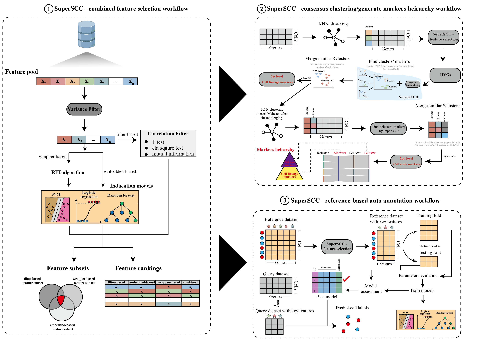

.. SuperSCC documentation master file, created by
   sphinx-quickstart on Thu Feb  6 10:23:34 2025.
   You can adapt this file completely to your liking, but it should at least
   contain the root `toctree` directive.

SuperSCC: Super Single Cell clustering
=======================================

SuperSCC (Super single cell clustering), a novel computational framework that enhances scRNA-seq analysis by enabling hierarchical clustering, marker gene detection, and robust label transfer across multiple datasets without the need for batch correction. SuperSCC performs iterative clustering, gene module detection, and cluster merging to construct cell type hierarchies and gene modules at multiple levels.

.. toctree::
   :maxdepth: 2
   :caption: Overview
   :hidden:
   
   Installation
   API
   Citation
   
.. toctree::
   :maxdepth: 2
   :caption: Tutorial
   
   Tutorials/tutorial_feature_selection
   Tutorials/tutorial_label_transfer
   Tutorials/tutorial_clustering
   Tutorials/tutorial_gene_module  

